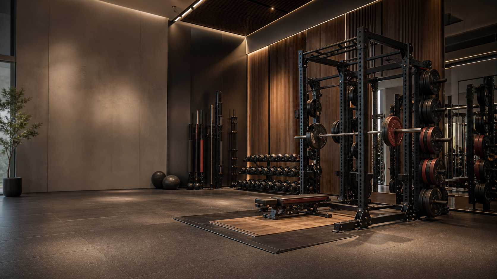

# Codex Skins

一个非官方 Codex Desktop 主题皮肤合集，主题包适配
[`Fei-Away/Codex-Dream-Skin`](https://github.com/Fei-Away/Codex-Dream-Skin)。

> 本仓库不是 OpenAI / Codex 官方项目。主题通过 Codex Dream Skin 的本地注入机制生效，不修改 Codex `.app`、`app.asar` 或应用签名。

## 已有主题

| 主题 | 风格 | 目录 |
| --- | --- | --- |
| 铁律训练场 | 高端商业力量区 / 健身房 | [`dream-skin/preset-iron-discipline`](./dream-skin/preset-iron-discipline/) |

## 预览



## 如何使用

先安装并启动上游项目 Codex Dream Skin，然后把想用的主题复制到它的主题库。

```bash
git clone https://github.com/<your-name>/codex-skins.git
cd codex-skins

./scripts/install-local-theme.sh preset-iron-discipline
~/.codex/codex-dream-skin-studio/scripts/switch-theme-macos.sh \
  --id preset-iron-discipline
```

如果还没安装 Codex Dream Skin，请先按上游 macOS 说明完成安装：
https://github.com/Fei-Away/Codex-Dream-Skin/tree/main/macos

## 主题包结构

每个主题目录都遵循上游 `preset-*` 结构：

```text
preset-<slug>/
├── theme.json
├── background.jpg
├── preview.png
└── README.md
```

`background.jpg` 是真正被注入使用的纯背景图；`preview.png` 只用于 GitHub 和社媒展示。

## 分享建议

- 公开分享时说明这是非官方主题，不是 Codex 官方功能。
- 只发布自己原创、AI 生成且可分享、或明确授权的素材。
- 不要上传明星、网红、影视/游戏角色、商标 logo、带 UI 截图的背景图。
- 推荐每个主题都保留 `README.md`，写清楚风格、来源和使用方式。

## 许可

当前还没有选择正式开源许可。公开发布前建议先决定：

- 代码/脚本：MIT
- 主题图片：CC BY-NC 4.0 或 CC BY 4.0

如果只是先发仓库收集反馈，也可以暂时不加 license，但别人严格来说没有再分发授权。
